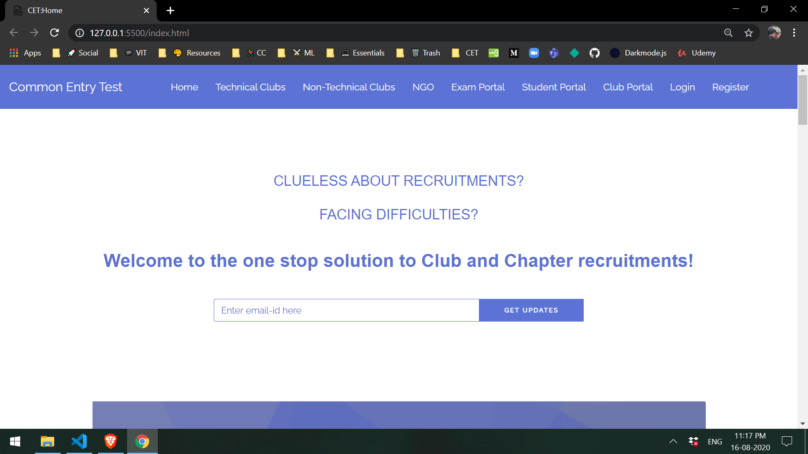
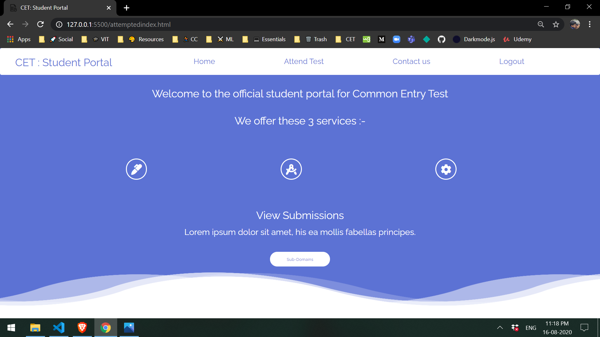

 

  

  <h3 align="center">Common Entry Test</h3>

  

    One stop solution to make club and chapter recruitments in VIT simpler and hassle free.
     
     
    <a href="https://codechefvit.github.io/Common-Entry-Test/index.html"><strong>Give a try</strong></a>
     
     
    <a href="https://documenter.getpostman.com/view/10696212/T1LTg5PH?version=latest">View Docs </a>
    ··
    <a href="https://youtu.be/edT0Mvr2VnU">Demo Video</a>
    ··
    <a href="https://github.com/CodeChefVIT/Common-Entry-Test/issues">Report Bug</a>
  

<!-- ABOUT THE PROJECT -->
## About The Project

 
    

  

 
    

### What is Common Entry Test ?
Common Entry Test is an assistive technology that helps make applying to clubs and chapters in VIT much easier and hassle free.

### Why Common Entry Test ?
1) No other system matches the diversity of clubs and chapters accessible through our portal. Explore and apply to clubs and chapters in VIT.

2) There is no need to repeat your applicant details for every club or chapter on your list. Enter your information one time and use it to apply to multiple clubs and chapters.

3) Our system alerts you when important dates are approaching. Manage your deadlines and view application progress in one convenient dashboard.

4) Save time by reducing the time you spend on tedious recruitment tests by giving just one standardised test and spend it with your friends and enjoy college life.

### Features
1) Reduce redundancy.

2) Well updated and informative.

3) Easy to use.

4) Appropriate precautions to prevent cheating on recruitment tests.
### Built With

* [Bootstrap](https://getbootstrap.com)
* [JQuery](https://jquery.com)
* [Ajax](https://www.w3schools.com/xml/ajax_intro.asp)
* [Django](https://www.djangoproject.com/)
<!-- CONTRIBUTING -->
## Contributing

Contributions are what make the open source community such an amazing place to be learn, inspire, and create. Any contributions you make are **greatly appreciated**.

1. Fork the Project
2. Create your Feature Branch 
3. Commit your Changes 
4. Push to the Branch 
5. Open a Pull Request

<!-- LICENSE -->
## License

Distributed under the MIT License. See `LICENSE` for more information.

## Contributors
1) Rakshit Maggon
2) Muskan Agarwal 
3) Nishchay Jain
4) Deepankar Jain

	With ❤️ by <a href="https://www.codechefvit.com/" target="_blank"> CodeChef-VIT</a>

